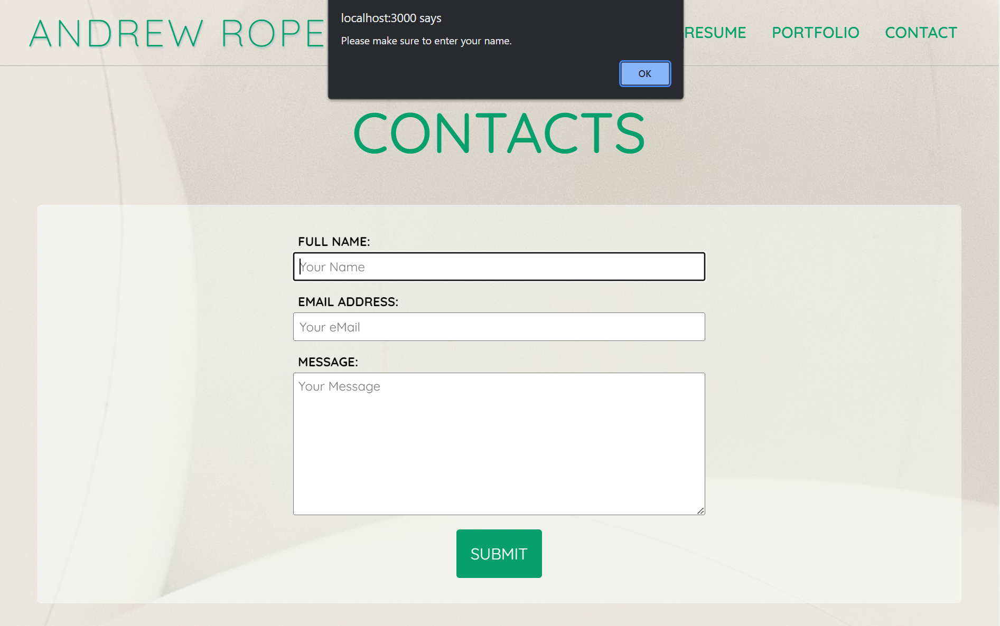

# Challenge 20 Resume By React

## Description

The purpose of this web appilcation is to highlight my coding abilities by showcasing a selection of projects and my work experience. The web application in of itself will also showcase specifically my ability to build in React, for a more modern and scalable web application.

## Table of Contents
* [Description](#description)
* [Installation](#installation)
* [Usage](#usage)
* [Contributions](#contributions)
* [License](#license)
* [Questions and Contacts](#questions-and-contacts)

## Installation

With the application being deployed on Netlify, there's installation needed on the client's side. Just visit .

## Usage

When visiting this application, users can visit different pages by using the navigation tabs. They can click links to visit both the deployed application and its repo on the Portfolio page. 

On the Resume page, users can download a copy of my resume by click the button on the top of the page. 

With the Contact page, a user can input their name, email and a message. While not implemented at this time, this will be for sending emails from this application to my email address. If a field is not properly filled, the user will recieve an alert.

## Contributions

Original CSS file 'reset.css' provided by ASU Bootcamp Course.

Adapted from preexisting [Hello-AndyJoe GitHub Challenge 2](https://github.com/Hello-AndyJoe/Challenge-2).

Quicksand font provided by Google Fonts and designed by Andrew Paglinawan : Link to Quicksand Font

[Match an Email - Regex Tutorial](https://gist.github.com/nicolewallace09/e4dc8aca65e7652501bdb8470df45c77) used in reference in contructing the email validation in the Contact.jsx file

All activities in Module 20 - React from the ASU Coding Bootcamp Course were used in reference in building this web application.

## License

MIT

## Questions and Contacts
Visit other repositories created by me at [github.com/hello-andyjoe](https://github.com/hello-andyjoe)

If you have questions, please email me at [andrew.joseph.roper@gmail.com](mailto:andrew.joseph.roper@gmail.com)
